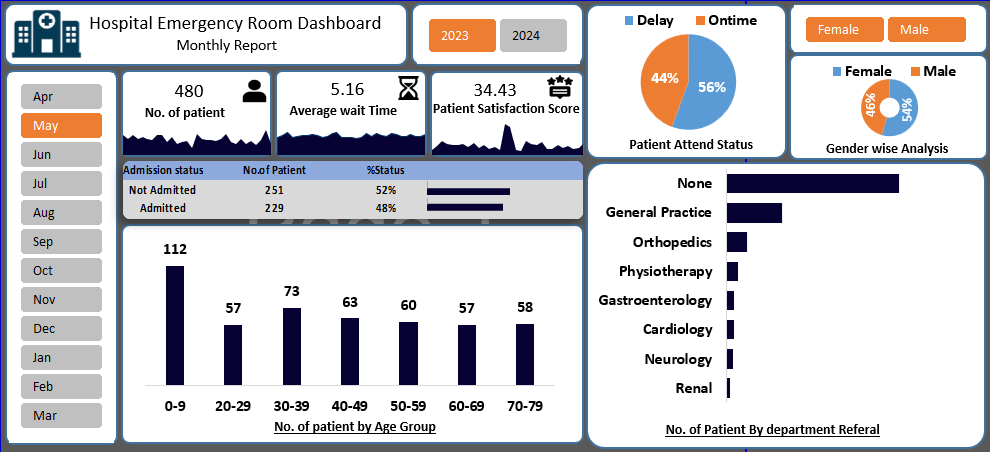

# 🏥 Hospital Emergency Room Dashboard

An interactive Microsoft Excel dashboard designed to analyze
hospital emergency room performance, patient flow, waiting time,
satisfaction, admissions, attendance, demographics, and department
referrals.

The dashboard converts patient-level emergency room data into a compact
management view with KPI cards, trend charts, demographic analysis,
admission status, attendance status, department referrals, and
slicer-based filtering.

## 📊 Dashboard Overview

The dashboard provides a high-level view of emergency room activity and
helps identify operational patterns such as:

Total number of patients

Average patient waiting time

Average patient satisfaction score

Daily patient-volume trends

Daily waiting-time trends

Daily satisfaction trends

Admission vs. non-admission

Patient gender distribution

Age-group distribution

On-time vs. delayed attendance

Department referral distribution

Year-based filtering

## 🔑 Key KPIs

Based on the current dashboard data:

KPI                                           Value

👥 **Total Patients                           480**
⏱️ **Average Wait Time              34.43 minutes**
⭐ **Average Satisfaction Score              5.16**
🏥 **Admitted Patients                        229**
🚪 **Not Admitted                             251**
⏰ **Delayed Attendance                       267**
✅ **On-Time Attendance                       213**

These KPIs provide a quick snapshot of emergency room workload, service
efficiency, patient experience, and admission outcomes.

## 📈 Dashboard Visualizations

1. Daily Patient Volume

Tracks the number of emergency room patients by day and highlights
changes in patient demand throughout the month.

2. Average Wait Time Trend

Shows the daily average patient waiting time, helping identify periods
of higher waiting pressure.

3. Patient Satisfaction Trend

Visualizes daily satisfaction scores to monitor changes in patient
experience.

4. Admission Status

Compares patients who were Admitted with those who were Not
Admitted.

5. Age Group Analysis

Breaks patients into age groups to understand the demographic
composition of the emergency room.

6. Gender Analysis

Compares the number of Female and Male patients.

7. Attendance Status

Shows the difference between patients who arrived On Time and those
recorded as Delayed.

8. Department Referral Analysis

Displays patient referrals across departments including:

General Practice

Orthopedics

Physiotherapy

Cardiology

Gastroenterology

Neurology

Renal

## 🎛️ Interactive Filtering

The workbook includes a Year slicer for interactive filtering.

When the slicer is connected correctly to the underlying
PivotTables/PivotCharts, users can select a year and update the
dashboard analysis dynamically.

Important: Excel slicers require the workbook's
PivotTables/PivotCharts to remain connected to the same source/cache.
If a slicer does not update a particular chart, check the slicer's
Report Connections / PivotTable Connections in Excel.

## 🗂️ Workbook Structure

The Excel workbook is organized into the following sheets:

Sheet                               Purpose

Daseboard                       Main interactive dashboard

Pivot Report                    Supporting PivotTable calculations
and summaries

Daliy ER no of patient          Daily emergency room patient trend

Average wait time daily trend   Daily average waiting-time analysis

Satisfaction score daily trends Daily satisfaction analysis

## 🧮 Main Metrics Used

The dashboard is built around several important analytical measures:

Patient Count --- distinct number of patient IDs

Average Wait Time --- average patient waiting time

Average Satisfaction Score --- average recorded satisfaction
score

Admission Status --- admitted vs. not admitted

Attendance Status --- delayed vs. on-time

Gender Distribution --- female vs. male patient count

Age Group Distribution --- patient count by age range

Department Referral --- patient count by referred department

## 💡 Business Insights

The current dataset shows several useful operational signals:

The emergency room handled 480 patients in the analyzed period.

The average waiting time was approximately 34.43 minutes, making
patient-flow efficiency an important operational metric.

229 patients were admitted, while 251 were not admitted.

267 patients were recorded as delayed, compared with 213
on-time patients, indicating that attendance timing is an area
worth monitoring.

Female patients accounted for 261 records and male patients for
219.

General Practice had the highest named department-referral
count, with 93 patients.

A large number of records have no department referral recorded, so
improving referral-data completeness could strengthen departmental
analysis.

## 🛠️ Tools & Technologies

Microsoft Excel

PivotTables

PivotCharts

Excel Slicers

Dashboard design

Data aggregation

Trend analysis

KPI visualization

## 🎯 Project Objective

The primary objective of this project is to transform raw hospital
emergency room records into an interactive, management-friendly Excel
dashboard.

The dashboard can support analysis of:

Patient Volume → Waiting Time → Attendance → Admission → Satisfaction
→ Demographics → Department Referrals

This makes it easier to identify operational trends and communicate key
findings through a single visual interface.

## 📁 Project File

The main project workbook is:

Hospital_Emergency_Room_Dashboard.xlsx

Open the workbook in Microsoft Excel to interact with PivotTables,
PivotCharts, and slicers.

## 🚀 Future Improvements

Possible enhancements for a more advanced version include:

Add additional slicers such as Gender, Admission Status,
Attendance Status, and Department Referral

Connect all dashboard visuals to a common PivotTable/filter
structure

Add month and date filters

Add conditional KPI indicators

Add target vs. actual performance metrics

Add automated refresh functionality

Improve accessibility with clearer chart labels and consistent
number formatting

Add a dedicated Key Insights section

Add a data dictionary and data-cleaning documentation

## 📌 Project Type

**Data Analytics | Excel Dashboard | Healthcare Analytics**

## 👨‍💻 Created By

**Aman Pareek**

Aspiring Data Analyst | Excel | SQL | Python | Power BI

## 📸 Dashboard Preview

